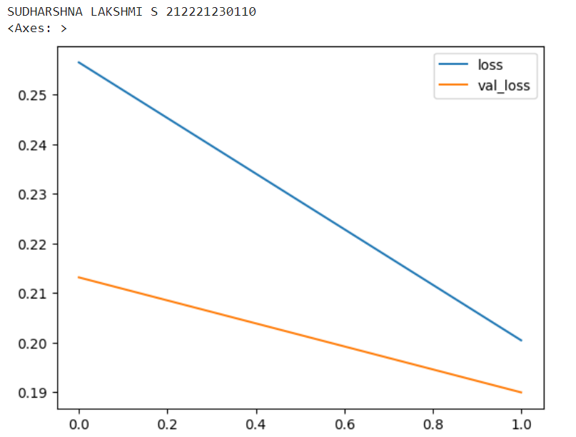
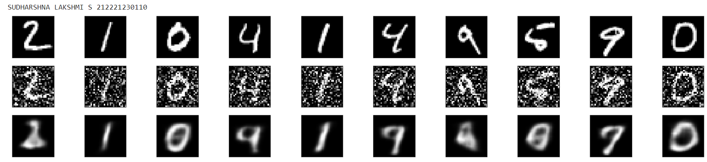

# Convolutional Autoencoder for Image Denoising

## AIM

To develop a convolutional autoencoder for image denoising application.

## Problem Statement and Dataset
An unsupervised artificial neural network called an autoencoder is taught to replicate its input into its output. The image will be encoded into a lower-dimensional representation by an autoencoder, which will subsequently decode the representation back to the original image.To obtain an identical output to the input is the aim of an autoencoder. MaxPooling, convolutional, and upsampling layers are used by autoencoders to denoise images. For this project, the MNIST dataset is being used. The handwritten numbers of the MNIST dataset are gathered together. The assignment is to categorize a provided image of a handwritten digit into one of ten classes, which together represent the integer values 0 through 9. A set of 60,000 handwritten, 28 X 28 digits make up the dataset. Here, we construct a model of a convolutional neural network that can categorize to the correct numerical value.

## DESIGN STEPS
1. Bring in the required dataset and libraries.
2. To make computations easier, load the dataset and scale the values.
3. For both the train and test sets, randomly add noise to the photos.
4. Utilizing the Convolutional Layer Pooling Layer Up Sampling Layer, construct the neural model. Verify that the model's input and output shapes are the same.
5. Allow test data to pass for manual validation.
6. For visualization, plot the forecasts.

## PROGRAM
```
from tensorflow import keras
from tensorflow.keras import layers
from tensorflow.keras import utils
from tensorflow.keras import models
from tensorflow.keras.datasets import mnist
import numpy as np
import pandas as pd
import matplotlib.pyplot as plt

(x_train, _), (x_test, _) = mnist.load_data()

x_train.shape

x_train_scaled = x_train.astype('float32') / 255.
x_test_scaled = x_test.astype('float32') / 255.
x_train_scaled = np.reshape(x_train_scaled, (len(x_train_scaled), 28, 28, 1))
x_test_scaled = np.reshape(x_test_scaled, (len(x_test_scaled), 28, 28, 1))

noise_factor = 0.5
x_train_noisy = x_train_scaled + noise_factor * np.random.normal(loc=0.0, scale=1.0, size=x_train_scaled.shape)
x_test_noisy = x_test_scaled + noise_factor * np.random.normal(loc=0.0, scale=1.0, size=x_test_scaled.shape)

x_train_noisy = np.clip(x_train_noisy, 0., 1.)
x_test_noisy = np.clip(x_test_noisy, 0., 1.)

n = 10
plt.figure(figsize=(20, 2))
for i in range(1, n + 1):
    ax = plt.subplot(1, n, i)
    plt.imshow(x_test_noisy[i].reshape(28, 28))
    plt.gray()
    ax.get_xaxis().set_visible(False)
    ax.get_yaxis().set_visible(False)
plt.show()

print("Sudharshna Lakshmi S 212221230110")
input_img = keras.Input(shape=(28, 28, 1))
x=layers.Conv2D(16,(5,5),activation='relu',padding='same')(input_img)
x=layers.MaxPooling2D((2,2),padding='same')(x)
x=layers.Conv2D(4,(3,3),activation='relu',padding='same')(x)
x=layers.MaxPooling2D((2,2),padding='same')(x)
x=layers.Conv2D(4,(3,3),activation='relu',padding='same')(x)
x=layers.MaxPooling2D((2,2),padding='same')(x)
x=layers.Conv2D(8,(7,7),activation='relu',padding='same')(x)
encoded = layers.MaxPooling2D((2, 2), padding='same')(x)
x=layers.Conv2D(4,(3,3),activation='relu',padding='same')(encoded)
x=layers.UpSampling2D((2,2))(x)
x=layers.Conv2D(4,(3,3),activation='relu',padding='same')(x)
x=layers.UpSampling2D((2,2))(x)
x=layers.Conv2D(8,(5,5),activation='relu',padding='same')(x)
x=layers.UpSampling2D((2,2))(x)
x=layers.Conv2D(16,(5,5),activation='relu',padding='same')(x)
x=layers.UpSampling2D((2,2))(x)
x=layers.Conv2D(16,(5,5),activation='relu')(x)
x=layers.UpSampling2D((1,1))(x)
decoded = layers.Conv2D(1, (3, 3), activation='sigmoid', padding='same')(x)

autoencoder = keras.Model(input_img, decoded)
autoencoder.summary()

autoencoder.compile(optimizer='adam', loss='binary_crossentropy')

autoencoder.fit(x_train_noisy, x_train_scaled,
                epochs=2,
                batch_size=128,
                shuffle=True,
                validation_data=(x_test_noisy, x_test_scaled))

print("SUDHARSHNA LAKSHMI S 212221230110")
metrics = pd.DataFrame(autoencoder.history.history)
metrics[['loss','val_loss']].plot()

decoded_imgs = autoencoder.predict(x_test_noisy)

print("SUDHARSHNA LAKSHMI S 212221230110")
n = 10
plt.figure(figsize=(20, 4))
for i in range(1, n + 1):
    # Display original
    ax = plt.subplot(3, n, i)
    plt.imshow(x_test_scaled[i].reshape(28, 28))
    plt.gray()
    ax.get_xaxis().set_visible(False)
    ax.get_yaxis().set_visible(False)

    # Display noisy
    ax = plt.subplot(3, n, i+n)
    plt.imshow(x_test_noisy[i].reshape(28, 28))
    plt.gray()
    ax.get_xaxis().set_visible(False)
    ax.get_yaxis().set_visible(False)

    # Display reconstruction
    ax = plt.subplot(3, n, i + 2*n)
    plt.imshow(decoded_imgs[i].reshape(28, 28))
    plt.gray()
    ax.get_xaxis().set_visible(False)
    ax.get_yaxis().set_visible(False)
plt.show()


```

## OUTPUT

### Training Loss, Validation Loss Vs Iteration Plot


### Original vs Noisy Vs Reconstructed Image



## RESULT
Thus we have successfully developed a convolutional autoencoder for image denoising application.
